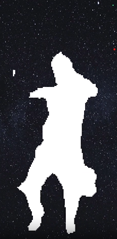

# AR Rock & Roll

## 💡 Introduction:
Rock & Roll is an augmented reality application that allows users to dance and see their segmented version of themselves dance alongside them with a starry night background. This case study explores how the Lightship ARDK's Semantic Segmentation feature was utilized to create engaging and visually stunning effects in real-time.

## 💡 Background:
Semantic Segmentation is a computer vision technique that assigns a class label to each pixel in an image, allowing developers to identify different objects in the real world and apply visual effects to them. The Lightship ARDK is a powerful tool for developers looking to create augmented reality experiences, providing features such as Plane Tracking, Scanning Feature, and Semantic Segmentation.

## 💡 Methodology:
The Rock & Roll application uses the Semantic Segmentation feature of the Lightship ARDK to segment different people and overlay a white texture on top of them with a starry night background. This allows users to dance and see their segmented version dance with them in real-time. The ability to interact and personalize the experience adds an engaging element to the application.

## 💡 Results:
The use of Semantic Segmentation in the Rock & Roll application has resulted in an immersive and visually stunning experience for users. The ability to see a segmented version of themselves dance alongside them adds an element of personalization to the application. The real-time nature of the effect further enhances the experience, making it more engaging and entertaining.

## 💡 Conclusion:
The Rock & Roll application is a great example of how Semantic Segmentation can be utilized to create engaging and visually stunning augmented reality experiences. With the rise of augmented reality technology, we can expect to see more applications that utilize computer vision techniques to create immersive experiences for users. The Lightship ARDK provides developers with a powerful toolset to create these experiences, making it an ideal choice for those looking to develop augmented reality applications.

## ⚒️ Development Tools
- Unity Engine 2021.3.15f1
- Lightship ARDK 2.5.1
- Visual Studio Code 1.77.1

# 💡 Rock & Roll

